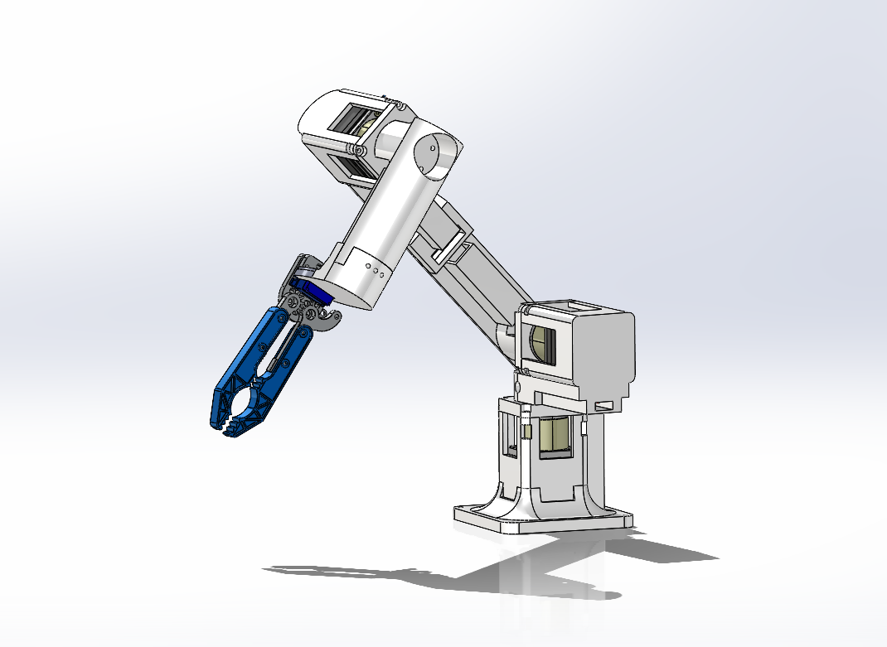
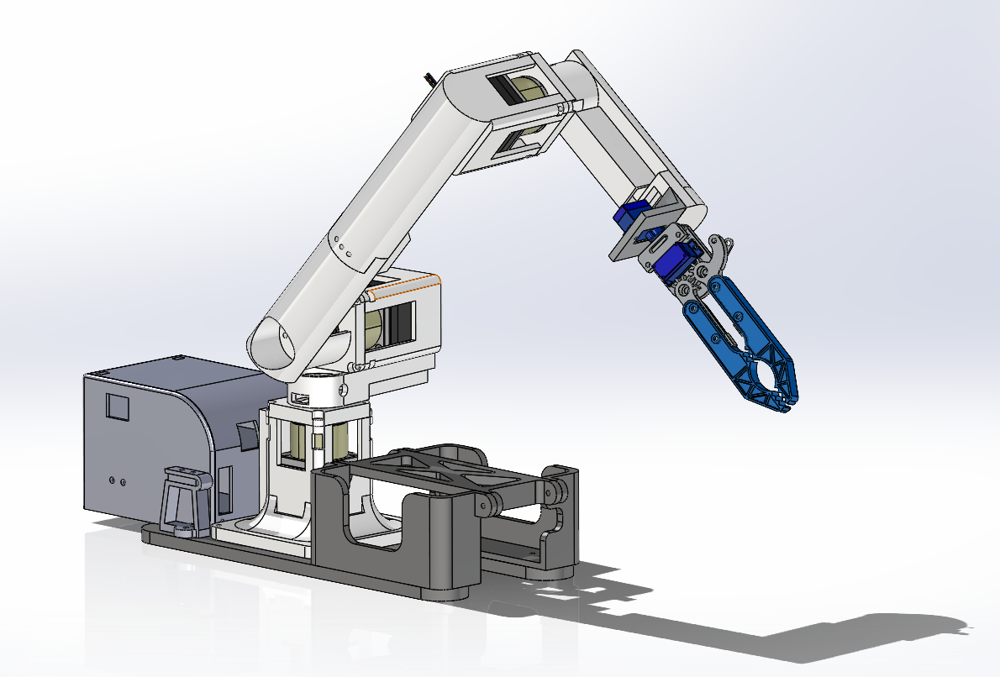

# BiQu Arm

Git repository for the BiQu MQP 23-24, containing documentation for the Arduino, CAD, and URDF files for the custom robot arm.

## Table of Contents

- [Arduino Library](#arduino-library)
- [SolidWorks CAD](#solidworks-cad)
- [BiQu Go1 URDF](#biqu-go1-urdf)

## <a names="arduino-library"></a>1. Arduino Library
This folder contains Arduino libraries for controlling a robotic arm via different communication interfaces. Currently, two communication methods are supported: serial USB connection and ROS (Robot Operating System) messages.

### Robot_Arm_Serial
This library enables users to command the robotic arm to move to a desired position using a serial USB connection. Commands are sent via the "Serial Monitor" in the Arduino IDE. The command format consists of joint positions in the following order: [J1 Pos], [J2 Pos], [J3 Pos], [Gripper Pos]. The gripper position is optional. 

For example, to move the arm to the joint configuration of 100, -90, and 45 without the gripper moving, the command should be sent as follows:
```
"100, -90, 45, "
```

### Robot_Arm_ROS
This library facilitates controlling the robotic arm using ROS messages. Users can send ROS messages to command the arm to move to a desired position. This enables integration with ROS-based robotic systems and frameworks.

## 2. SolidWorks CAD

This directory contains the SolidWorks CAD files for the custom robot arm. It includes two assembly files:
- `Arm_Gripper_Assem.SLDASM`: This file represents the assembly of the arm itself, including the gripper mechanism.

- `Whole_Assem.SLDASM`: This file represents the assembly of the entire system, including the arm, controller box, onboard Intel NUC, and the rails designed for connection to the Unitree Go1 robot.


## 3. BiQu Go1 URDF
